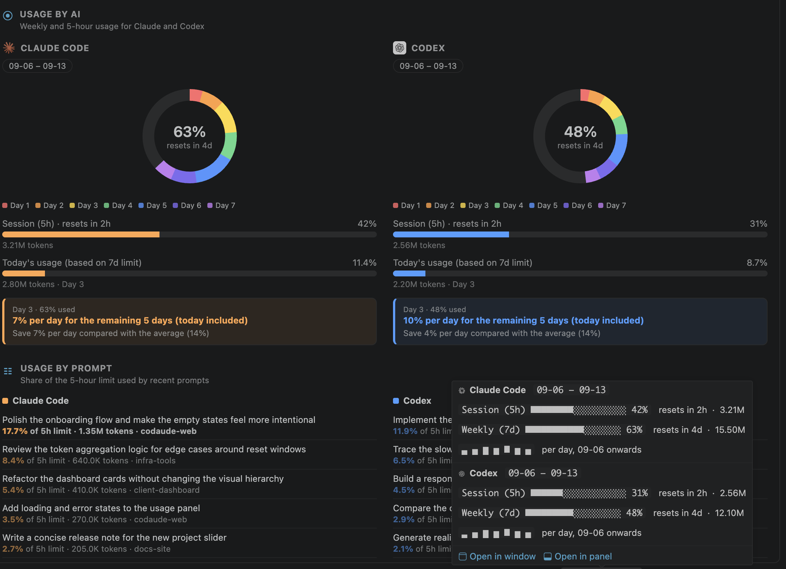

# Codaude

**Codex + Claude, in one status bar.**

Codaude tracks how much of your Claude Code and Codex usage limits you have burned — live, inside VS Code. It reads the session logs both CLIs already write to your disk. No API calls, no API keys, no extra tokens spent to look at your own numbers.



## Features

### Status bar

Two numbers, always visible: the percentage of each tool's **5-hour limit** you have used right now.

```
 Claude 42%  |   Codex 17%
```

If a tool has never reported a limit (not installed, or never fetched), Codaude falls back to the raw token count for the last 5 hours instead.

### Hover tooltip

Hover the status bar for the full picture without opening anything:

- 5-hour and weekly limit bars drawn in block characters, with the exact percentage
- `resets in 4h` / `resets in 5d` countdowns, matching what the CLIs themselves print
- a 7-day sparkline of per-day token spend
- a `· 3h old` marker when the limit snapshot the CLI cached has gone stale (30+ minutes)
- one-click links to open the panel or a floating window

### Usage panel

Open with **Codaude: Show Token Usage**, or click the status bar. Four sections:

**◉ Usage by AI** — per tool: a donut of your weekly limit, split by day with one colour per day; a 5-hour progress bar; today's spend as a slice of the weekly limit; and a pacing callout that answers the only question that matters mid-week —

> Day 3 · 50% used — **10% per day for the remaining 5 days (today included)**
> Save 4% per day compared with the average (14%)

**☷ Usage by prompt** — your recent prompts, newest first, each with the share of the 5-hour limit it consumed. A prompt over 1M tokens is bolded. Shows 5 at a time with a _Show more (+5)_ button.

**▣ Usage by project** — token totals per project folder across the weekly window, ranked with medals, split Claude vs Codex, in a horizontal card slider.

**↔ Claude vs Codex** — one bar for the last 5 hours, one for the week, split by each tool's share.

### Floating window

**Codaude: Open Token Usage in New Window** renders the same panel into an editor tab and immediately detaches it into its own OS window — keep it on a second monitor while you work.

### Live updates

`FileSystemWatcher`s sit on both log directories and on `~/.claude.json`. Recursive watchers fire repeatedly for a single write, so every event is debounced by 1.5 s before a rescan. The panel is re-rendered only while it is actually visible.

## How it works

Everything is read locally and read-only. Nothing is uploaded, sent, or written back.

| Tool        | Paths                                                                             |
| ----------- | --------------------------------------------------------------------------------- |
| Claude Code | `~/.claude/projects/**/*.jsonl` (usage), `~/.claude.json` (cached limit snapshot) |
| Codex       | `~/.codex/sessions/**/*.jsonl` (usage + `rate_limits`)                            |

Only files modified in the last 7 days are scanned; older logs are skipped by `mtime`.

**Claude Code** writes one line per assistant message, but the same message reappears in resumed or streamed sessions — Codaude dedupes on `message.id` + `requestId`, then sums `input_tokens`, `output_tokens`, `cache_read_input_tokens`, and `cache_creation_input_tokens`.

**Codex** logs a _running_ `total_token_usage` on every `token_count` event, so a turn's cost is the delta against the previous event in the same rollout file. `cached_input_tokens` is a subset of `input_tokens` there (unlike Claude's cache fields), so it is subtracted out instead of double-counted. A counter reset counts as the full value, never a negative delta.

**Limits are the providers' own numbers, not our estimate.** Claude Code caches its `/usage` response in `~/.claude.json`; Codex stamps `rate_limits` onto every `token_count` event. Codaude reads the reported percentage and reset time, and every window is measured backwards from that reset time — not from midnight, and not from "now". When a tool has never reported limits, it falls back to a plain rolling 5 hours / 7 days ending now, and the panel labels that range `estimated`.

Windows are matched by length (`window_minutes`), not by `primary`/`secondary`, so the 5-hour and weekly bars stay correct whichever order a provider lists them in.

## Requirements

- VS Code `1.135.0` or newer
- [Claude Code](https://claude.com/claude-code) and/or [Codex](https://developers.openai.com/codex/) installed and used at least once

Only one of the two is enough — a tool that has never run simply shows no data.

## Commands

| Command                                   | What it does                                 |
| ----------------------------------------- | -------------------------------------------- |
| `Codaude: Show Token Usage`               | Focus the **Codaude** panel                  |
| `Codaude: Open Token Usage in New Window` | Open the panel as a detached floating window |

## Extension Settings

None. Codaude works out of the box.

## Privacy

Codaude never makes a network request. Your prompts are read from local log files and rendered only inside the VS Code webview on your own machine.

## Known Issues

- Limit percentages are only as fresh as the last time each CLI fetched them. The tooltip and panel mark a snapshot older than 30 minutes as `Xm old`.
- Codex per-turn cost is a delta of a running counter, so a session that resets its baseline mid-file charges that one turn at full value.
- Per-day colours in the donut split the provider's weekly percentage in proportion to the tokens Codaude counted, so a day's slice is an attribution of the real total, not a separately reported number.

## Release Notes

### 0.0.1

Initial release — status bar tracking, hover tooltip, usage panel (by AI / by prompt / by project / head-to-head), floating window, live log watching.
